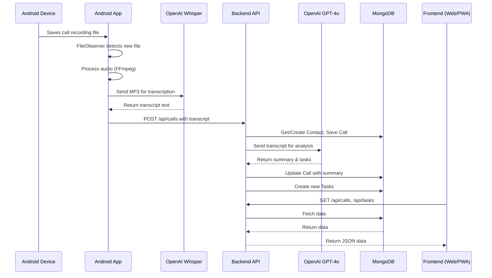

# BrachaAI - High-Level Architecture

## 1. Executive Summary & Architecture Style

**BrachaAI** is an AI-powered personal assistant designed for small businesses. It automates call processing, task creation, and contact management by recording phone calls, transcribing them, and using AI to extract actionable insights.

The system is designed using a **Client-Server architecture** with a distinct separation of concerns between its three core modules. The overall style can be described as a **Monolithic Backend with a Hybrid Mobile/Web Frontend**.

1.  **Android Application**: A native Android client responsible for call monitoring and initial audio processing. It also acts as a hybrid container, embedding the web frontend within a WebView.
2.  **Backend System**: A central Node.js/Express monolith that serves as the API and processing hub. It handles data persistence, business logic, and all AI interactions post-transcription.
3.  **Frontend Application**: A modern Single-Page Application (SPA) built with React, designed as a Progressive Web App (PWA) for a consistent user experience across web and mobile.

This architecture was chosen to leverage the strengths of each platform: native Android capabilities for background services, a robust and scalable backend for centralized processing, and a modern, cross-platform web UI for user interaction.

---

## 2. Tech Stack & Key Dependencies

The project is divided into three distinct technology stacks.

### 2.1. Android Application

*   **Language**: Kotlin
*   **UI**: Jetpack Compose
*   **Concurrency**: Kotlin Coroutines
*   **Audio Processing**: `ffmpeg-kit-audio` for audio normalization.
*   **Speech-to-Text**: OpenAI Whisper API (`whisper-1` model).
*   **Networking**: OkHttp (for communication with Whisper and the backend).
*   **Build System**: Gradle

### 2.2. Backend System

*   **Runtime**: Node.js
*   **Framework**: Express.js with TypeScript
*   **Database**: MongoDB with Mongoose ODM
*   **AI Analysis**: OpenAI API (`gpt-4o` model)
*   **Configuration**: `dotenv` for environment variable management.
*   **Key Libraries**: `cors`, `mongoose`

### 2.3. Frontend Application

*   **Framework**: React 18+ with TypeScript
*   **Bundler**: Vite
*   **Routing**: React Router v6
*   **Styling**: CSS Modules & Global CSS
*   **HTTP Client**: Native Fetch API
*   **PWA**: Service Workers, Web App Manifest

---

## 3. Core Components & Folder Structure

### 3.1. `android/`

The native Android application handles device-level interactions.

*   **`CallMonitorService`**: A persistent foreground service using `FileObserver` to detect new call recording audio files.
*   **`AudioProcessor`**: Orchestrates the processing pipeline: parsing the filename, converting audio to MP3 via FFmpeg, and sending it for transcription.
*   **`WhisperApiClient`**: A dedicated client for sending audio to the OpenAI Whisper API and receiving the Hebrew transcription.
*   **`MainActivity`**: The main UI entry point, responsible for requesting permissions and hosting the WebView that renders the frontend application.
*   **`PhoneStateReceiver`**: A manifest-registered broadcast receiver for `ACTION_PHONE_STATE_CHANGED`, the entry point of the incoming-call briefing overlay. It shows a card on RINGING and tears it down on IDLE.
*   **`OverlayDecider`**: Pure decision logic, with no Android dependencies, that turns a ringing number into "show this briefing" or "show nothing" — so every branch of the ring path is unit-testable without the receiver or the service around it.
*   **`CallOverlayService`**: Renders the briefing as a floating `WindowManager` card for the duration of the call, and refreshes it live from the backend while it is on screen. Requires the `SYSTEM_ALERT_WINDOW` permission.
*   **`BriefingNotifier`**: The fallback renderer, used when the overlay permission is not held. Posts the same briefing as a silent high-importance notification.
*   **`BriefingStore`**: The on-device snapshot (`briefings.json`) that the overlay reads when the phone rings, so a ringing call never has to wait on the network. Disposable derived data: a corrupt or missing snapshot means "no card until the next sync", never data loss.
*   **`BriefingSync`**: Refreshes that snapshot from the backend on a periodic tick, after an upload, and when the app returns to the foreground.
*   **`BriefingClient`**: A dedicated client for the backend's briefing endpoints, sharing the upload path's token-refresh handling.
*   **`PhoneNormalizer`**: Reduces every spelling of a phone number — with or without a country code, with a leading zero, withheld-call sentinels — to a single lookup key. The only place phone formats are interpreted, and the reason contact matching never has to happen on the backend.
*   **`app/src/main/assets/www/`**: This directory contains the production build of the frontend application. The GitHub Actions workflow automatically builds the frontend and copies the assets here, enabling the hybrid app approach.

### 3.2. `backend/`

The central API and data processing engine.

*   **`controllers/`**: Contains Express route handlers, such as `callController.ts`, which defines the logic for incoming API requests.
*   **`models/`**: Defines the Mongoose schemas for `User`, `Contact`, `Call`, and `Task`, which map directly to MongoDB collections.
*   **`routes/`**: Defines the API endpoints and maps them to the appropriate controllers.
*   **`services/`**: Encapsulates business logic.
    *   `aiService.ts`: Interacts with the OpenAI GPT-4o API to analyze transcripts, generate summaries, and create structured task lists.
    *   `briefingService.ts`: Assembles the per-contact briefing (most recent summarised call, plus a capped, priority-sorted list of open tasks and the untruncated open-task count) that the Android overlay shows when a known contact calls.
    *   `callService.ts`, `taskService.ts`, `userService.ts`: Handle CRUD operations and business logic related to their respective domains.
*   **`index.ts`**: The server entry point. It initializes the Express app, connects to MongoDB, and starts the server.

### 3.3. `frontend/`

The user-facing web application.

*   **`public/`**: Contains static assets, including `index.html`, the PWA `manifest.json`, and logos.
*   **`src/components/`**: Reusable React components (e.g., `CallList`, `TaskList`, `Header`).
*   **`src/pages/`**: Top-level components that represent application views (e.g., `Dashboard.tsx`, `Calls.tsx`).
*   **`src/services/api.ts`**: A centralized client for making HTTP requests to the backend API.
*   **`src/context/`**: React Context providers for managing global state, such as user authentication.
*   **`App.tsx`**: The root component that sets up routing and global layout.

---

## 4. Data Flow & System Interactions

The primary data flow is initiated by a phone call on the Android device.

1.  **Call Recording**: The Android OS's native call recorder saves an audio file (e.g., `.m4a`) to the device's storage. The filename format is `ContactName_YYMMDD_HHMMSS.ext`.
2.  **File Detection**: The `CallMonitorService` detects the new audio file via `FileObserver`.
3.  **Audio Processing (Android)**:
    *   The `AudioProcessor` is triggered.
    *   It parses the contact name and call time from the filename.
    *   It uses **FFmpeg** to convert the audio to a standardized MP3 format.
    *   The MP3 file is sent to the **OpenAI Whisper API** for transcription.
4.  **Backend Ingestion**:
    *   The Android app sends a `POST` request to the backend's `/api/calls` endpoint with the contact name, date, and full transcript.
5.  **AI Analysis & Persistence (Backend)**:
    *   The `callController` receives the data.
    *   It finds or creates a `Contact` record in MongoDB.
    *   The raw `Call` data (transcript, contact, etc.) is saved to MongoDB.
    *   The `aiService` is invoked, sending the transcript to the **OpenAI GPT-4o API**.
    *   GPT-4o returns a structured JSON object containing a call summary and a list of tasks with priorities.
    *   The `callService` updates the `Call` record with the summary.
    *   The `taskService` creates new `Task` documents in MongoDB from the AI-generated list.
6.  **User Interaction (Frontend)**:
    *   The user opens the BrachaAI application (either via a web browser or the Android app).
    *   The React frontend makes authenticated `GET` requests to the backend API (e.g., `/api/calls`, `/api/tasks`) to fetch and display data.
    *   Users can view call summaries, full transcripts, and manage their tasks and contacts. All user-initiated changes (e.g., updating a task's status) result in API calls to the backend, which updates the state in MongoDB.
7.  **Incoming-Call Briefing (Android)**:
    *   Independently of the flow above, the Android app periodically calls `GET /api/briefings` (on a timer, after every upload, and when the app comes to the foreground) to fetch a briefing for every contact and caches it on-device.
    *   When the phone rings, the app matches the caller against this on-device cache — no network round trip on the ring path — and, for a known contact with a summary or open tasks, shows a floating card (or a notification, if it lacks the overlay permission) with the contact's name, last call summary, and open tasks.
    *   `GET /api/briefings/:contactId` refreshes a single contact's briefing while its card is on screen.

---

## 5. Security, Configuration & Deployment

### 5.1. Configuration
*   **Backend**: Configuration is managed via environment variables loaded from a `.env` file using the `dotenv` package. This includes the `DATABASE_URL`, `OPENAI_API_KEY`, and `PORT`.
*   **Frontend**: Vite's environment variable system is used (`.env.development`, `.env.production`). The primary variable is `VITE_API_URL`, which points to the backend server.
*   **Android**: The `OPENAI_API_KEY` is securely injected at build time from a `local.properties` file into `BuildConfig`.

### 5.2. Security
*   **Authentication**: The frontend will implement a full authentication system (Login/Signup) to protect routes and user data. API endpoints on the backend are designed to be protected and associated with a `userId`.
*   **API Keys**: Sensitive keys (like the OpenAI API key) are managed through environment variables or build-time injection, and are not hardcoded in the source.
*   **Transport**: The Android application is configured with `usesCleartextTraffic=true` for development to communicate with the local backend server (`10.0.2.2`). For production, this should be disabled in favor of HTTPS.

### 5.3. Deployment & CI/CD
*   **Frontend Deployment**: The frontend is a static build generated by `npm run build`.
*   **Hybrid App Strategy**: The core deployment strategy for the mobile client involves embedding the web frontend into the Android application. A GitHub Actions workflow (`.github/workflows/build-and-copy.yml`) automates this process:
    1.  On every push, it installs frontend dependencies and runs `npm run build`.
    2.  It copies the resulting `dist/` folder contents into the Android app's `android/app/src/main/assets/www/` directory.
    3.  It commits the updated assets back to the repository.
*   **PWA**: The frontend is designed as a PWA, allowing it to be "installed" on a user's home screen from a web browser, providing an app-like experience with offline capabilities via a service worker.

---

## 6. Database Schema

The backend system uses MongoDB as its data store, with Mongoose as the Object Data Modeling (ODM) library. The data is structured into four main collections: `Users`, `Contacts`, `Calls`, and `Tasks`. All data is associated with a specific user to ensure multi-tenancy and data privacy.

### 6.1. User Schema
Represents an authenticated user of the application.

*   **`name`**: `String` (Required) - The user's full name.
*   **`email`**: `String` (Required, Unique) - The user's login email.
*   **`phone`**: `String` (Required) - The user's phone number.
*   **`avatar`**: `String` - URL to the user's profile picture.
*   **`permissions`**: `[String]` (Default: `['standard']`) - User roles or permissions.

### 6.2. Contact Schema
Represents a business or personal contact associated with a user.

*   **`userId`**: `ObjectId` (Required, Ref: `User`) - The user who owns this contact.
*   **`name`**: `String` (Default: `'unknown'`) - The contact's name, parsed from the call recording filename.
*   **`phone`**: `String` (Required) - The contact's phone number.

### 6.3. Call Schema
Represents a single recorded and processed phone call.

*   **`userId`**: `ObjectId` (Required, Ref: `User`) - The user involved in the call.
*   **`contactId`**: `ObjectId` (Required, Ref: `Contact`) - The contact involved in the call.
*   **`fullTranscript`**: `String` (Required) - The full text transcript from the Whisper API.
*   **`callSummary`**: `String` - The AI-generated summary from the GPT-4o API.
*   **`callDateTime`**: `Date` (Required) - The date and time the call occurred.
*   **`callLength`**: `Number` - The duration of the call in seconds.

### 6.4. Task Schema
Represents an actionable task extracted from a call by the AI.

*   **`userId`**: `ObjectId` (Required, Ref: `User`) - The user to whom the task is assigned.
*   **`contactId`**: `ObjectId` (Required, Ref: `Contact`) - The contact related to the task.
*   **`title`**: `String` (Required) - A concise title for the task.
*   **`description`**: `String` - A more detailed description of the task.
*   **`priority`**: `String` (Enum: `['LOW', 'MEDIUM', 'HIGH']`, Default: `'LOW'`) - The priority level determined by the AI.
*   **`status`**: `String` (Enum: `['todo', 'in-progress', 'done']`, Default: `'todo'`) - The current status of the task.

---

## 7. Framework & Library Versions

This section provides an overview of the major versions for the core technologies and libraries used in the project, as inferred from the project documentation and configuration files.

### 7.1. Android Application

*   **Android SDK**:
    *   `minSdk`: 26 (Android 8.0)
    *   `targetSdk`: 36
*   **Kotlin**: Version specified in the project's `build.gradle` file.
*   **Jetpack Compose**: Version specified in the project's `build.gradle` file.
*   **`ffmpeg-kit-audio`**: Version specified in the project's `build.gradle` file.

### 7.2. Backend System

*   **Node.js**: 20.x (as defined in `.github/workflows/build-and-copy.yml`)
*   **Express.js**: 5.x
*   **Mongoose**: Version specified in `backend/package.json`.
*   **TypeScript**: Version specified in `backend/package.json`.

### 7.3. Frontend Application

*   **React**: 18+
*   **React Router**: 6.x
*   **Vite**: Version specified in `frontend/package.json`.
*   **TypeScript**: Version specified in `frontend/package.json`.

### 7.4. External Services

*   **OpenAI API (Speech-to-Text)**: `whisper-1` model
*   **OpenAI API (AI Analysis)**: `gpt-4o` model